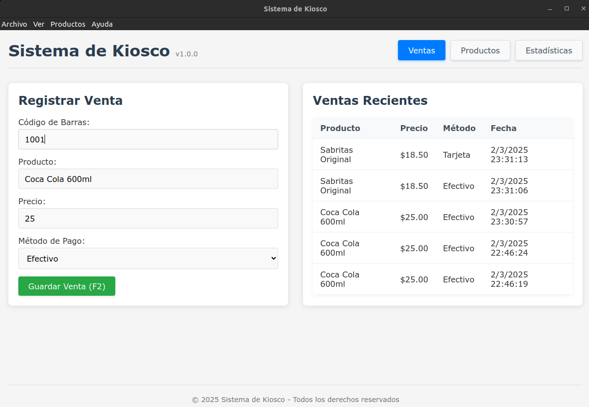
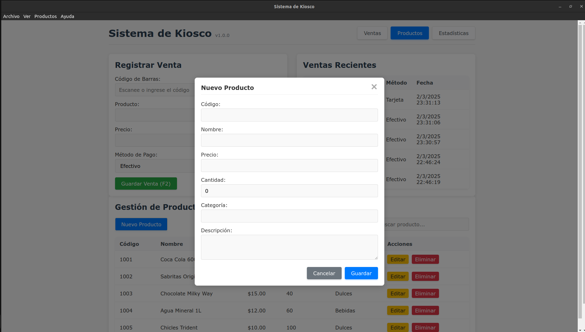
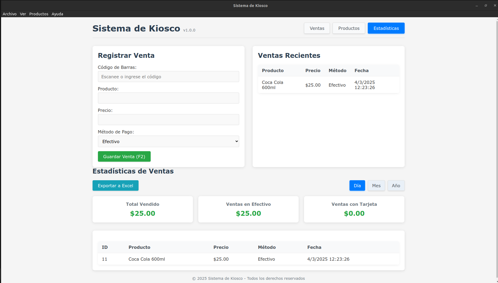
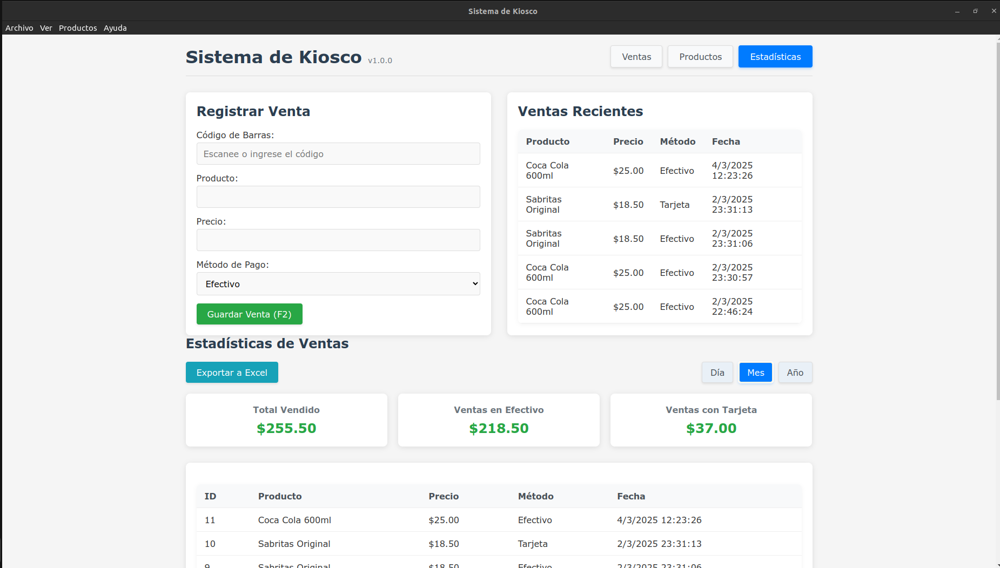
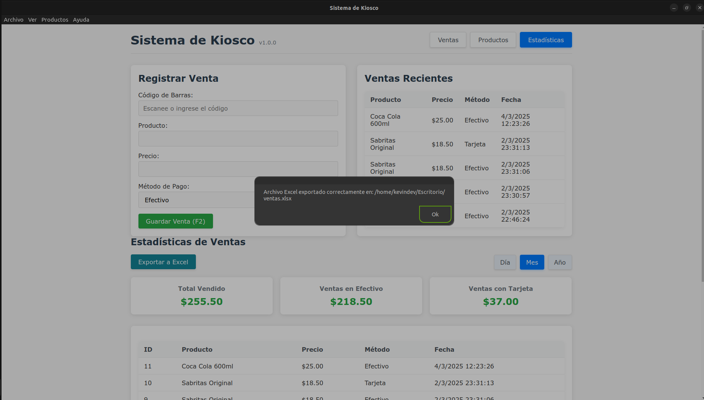

# 🏪 Sistema de Kiosco con Electron

<div align="center">



Una aplicación de escritorio moderna y eficiente para gestionar ventas en kioscos, desarrollada con Electron.js.

[]()
[]()
[]()

</div>

## ✨ Características Principales

- 🏷️ **Registro de Ventas**: Ingreso rápido de productos mediante código de barras
- 💳 **Métodos de Pago**: Soporte para pagos en efectivo y tarjeta
- 📊 **Estadísticas**: Visualización de ventas por día, mes y año
- 📑 **Exportación**: Exportación de datos a Excel
- ⌨️ **Atajos de Teclado**: F2 para guardar ventas rápidamente

## 🖼️ Capturas de Pantalla

<div align="center">

### Vista Principal de Ventas


### Panel de Estadísticas


### Gestión de Productos


### Reportes y Exportación


</div>

## 🛠️ Tecnologías Utilizadas

- **Electron.js**: Framework para aplicaciones de escritorio multiplataforma
- **SQLite**: Base de datos local robusta y eficiente
- **ExcelJS**: Generación de reportes profesionales en Excel
- **HTML/CSS/JavaScript**: Interfaz de usuario moderna y responsive

## 📁 Estructura del Proyecto

```
📂 electron-sistema-kiosco/
├── 📄 main.js - Proceso principal de Electron
├── 📄 index.html - Interfaz de usuario
├── 📄 renderer.js - Lógica del frontend
├── 📄 styles.css - Estilos de la aplicación
├── 📄 package.json - Dependencias y configuración
└── 📄 README.md - Documentación
```

## 🚀 Instalación

1. Clona este repositorio:
   ```bash
   git clone [URL del repositorio]
   ```

2. Instala las dependencias:
   ```bash
   npm install
   ```

3. Inicia la aplicación:
   ```bash
   npm start
   ```

## 📖 Uso

### 🛍️ Registro de Ventas

1. Ingresa el código de barras del producto (o selecciónalo de la lista)
2. El sistema automáticamente mostrará el nombre y precio del producto
3. Selecciona el método de pago (efectivo o tarjeta)
4. Presiona "Guardar Venta" o usa el atajo F2

### 📊 Estadísticas

1. Haz clic en la pestaña "Estadísticas"
2. Selecciona el período que deseas visualizar (día, mes, año)
3. Revisa los totales y el desglose de ventas
4. Exporta a Excel si necesitas un reporte detallado

## 👨‍💻 Desarrollo

Para construir la aplicación para distribución:

```bash
npm run build
```

Esto generará los archivos de instalación en la carpeta `dist`.

## 📄 Licencia

MIT - Ver el archivo [LICENSE](LICENSE) para más detalles

---

<div align="center">
Desarrollado con ❤️ para optimizar la gestión de kioscos
</div>


